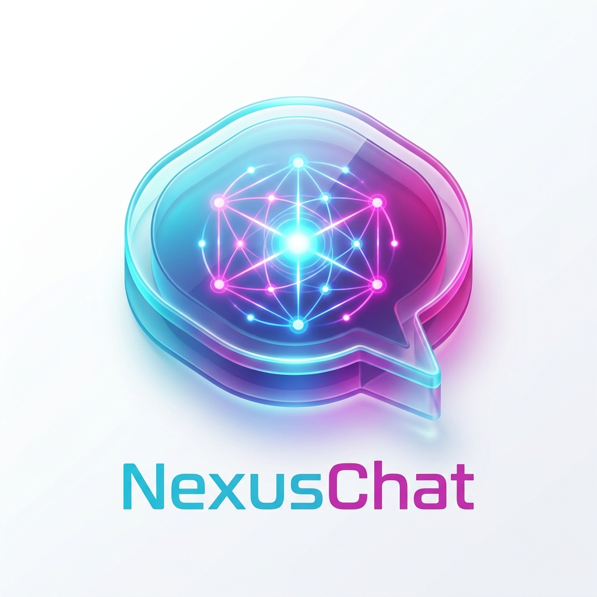

<div align="center">
  
  <h1>NexusChat</h1>
  <p><strong>A Resilient, Multi-Tenant AI RAG (Retrieval-Augmented Generation) Platform</strong></p>
</div>

---

## 📖 Overview

**NexusChat** is an advanced, production-ready document chat platform designed for enterprise and multi-tenant environments. It allows organizations to upload documents, automatically generate embeddings, and intelligently interact with their data using large language models.

Built with resilience in mind, NexusChat features a robust **Multi-Provider AI Orchestration Strategy**. It intelligently routes requests across cloud providers (like Gemini, Groq, OpenRouter, Cohere) and falls back to local models (like Ollama) to guarantee uptime and gracefully bypass rate limits (429 errors).

## ✨ Key Features

- 🏢 **Multi-Tenant Architecture:** Securely isolate workspaces, users, documents, and chat sessions by Tenant ID.
- 🧠 **Dynamic AI Provider Failover:** Automatic load balancing and API key rotation across multiple LLM providers. If a cloud provider hits a rate limit, NexusChat dynamically fails over to the next available provider or a local model.
- 📄 **Intelligent Document Processing (RAG):** Upload PDFs or text files. The system utilizes BullMQ and Redis to handle asynchronous chunking and vector embedding generation without blocking the main event loop.
- 🚀 **Modern Web Interface:** A sleek, glassmorphic React front-end (Vite) designed for intuitive user interaction, tenant switching, and system queue monitoring.
- 🔄 **Real-Time System Cache & Queue Monitoring:** Interactive management modals to monitor pending background document processing and active AI cached queries.

## 🛠️ Technology Stack

**Backend (API)**

- Node.js & TypeScript
- Express.js
- Prisma (ORM) & PostgreSQL (Vector DB / pgvector)
- BullMQ & Redis (Background Jobs)
- Multi-AI Integration (Gemini, Cohere, Groq, OpenRouter, HuggingFace, Ollama)

**Frontend (Web)**

- React.js (Vite)
- TailwindCSS (Styling)
- Lucide Icons
- Zustand (State Management)

## 🚦 Getting Started

### Prerequisites

- Node.js (v18+)
- pnpm (Package Manager)
- Redis Server (Running locally or via Docker)
- PostgreSQL with `pgvector` extension

### Installation

1. **Clone the repository:**

   ```bash
   git clone git@github.com:rushitrabadiya/NexusChat.git
   cd NexusChat
   ```

2. **Install dependencies:**

   ```bash
   pnpm install
   ```

3. **Configure Environment Variables:**
   Rename `.env.example` to `.env` (or create one) and add your database URL, Redis credentials, and AI provider API keys.

4. **Initialize Database:**

   ```bash
   cd packages/database
   pnpm prisma generate
   pnpm prisma db push
   ```

5. **Run the Development Server:**
   ```bash
   pnpm dev
   ```
   _The API will start on port 3000 and the Web Interface on port 5173._

### 🐳 Running Local AI Models (Ollama)

To utilize the local fallback mechanism and ensure maximum privacy, you can run Ollama via Docker. This allows NexusChat to route requests locally when cloud providers are rate-limited.

1. **Start the Ollama Docker Container:**

   ```bash
   docker run -d -v ollama:/root/.ollama -p 11434:11434 --name ollama ollama/ollama
   ```

2. **Pull and Run a Model (e.g., LLaMA 3 or Mistral):**
   ```bash
   docker exec -it ollama ollama run llama3
   # or
   docker exec -it ollama ollama run mistral
   ```

## 🏗️ Project Structure

This project uses a monorepo setup powered by Turborepo:

- `apps/api`: The core Express backend managing RAG pipelines and AI orchestration.
- `apps/web`: The React frontend interface.
- `packages/database`: Shared Prisma schema and database connection logic.
- `packages/shared`: Shared Typescript types, enums, and schemas.

## 📝 License

This project is licensed under the MIT License.
